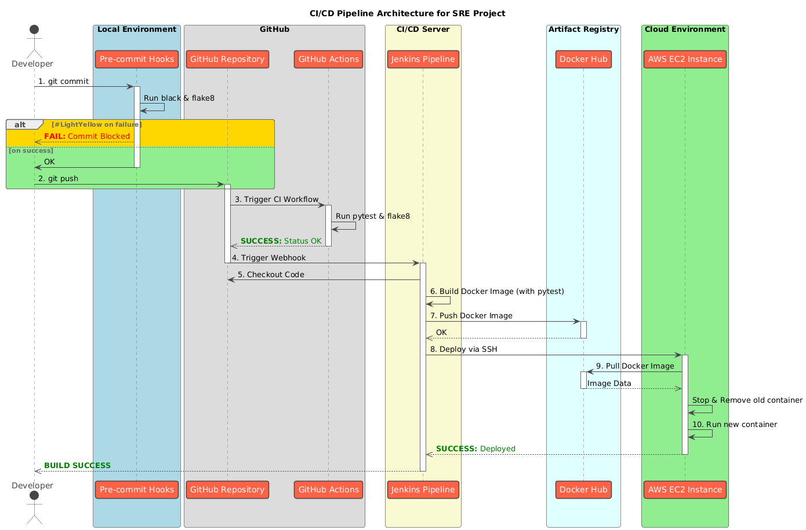

# Full-Cycle CI/CD & Observability Pipeline for a Python API



## 🚀 About This Project

This project demonstrates a complete, production-ready CI/CD (Continuous Integration/Continuous Deployment) pipeline for a containerized Python web application. It was built as a practical exercise to showcase skills and best practices in DevOps, Site Reliability Engineering (SRE), and automation.

The pipeline automates every step from code commit to deployment, including quality assurance, security scanning, and final deployment to a cloud environment. It features a multi-layered quality gate system, ensuring that only high-quality, secure, and well-tested code reaches production.

**See it live!** The application is deployed on AWS and available at:
`http://16.171.198.37:8000/tasks`

---

## ✨ Key Features

*   **Full Automation:** Zero-touch deployment pipeline triggered by a `git push`.
*   **Infrastructure as Code:** The entire CI/CD process is defined as code (`Jenkinsfile`).
*   **Containerization:** The application is packaged into a lightweight, multi-stage Docker image for consistency across all environments.
*   **Multi-Layered Quality Gates:**
    1.  **Local Checks (`pre-commit`):** Automatic code formatting (`black`) and style checks (`flake8`) before every commit.
    2.  **CI Validation (GitHub Actions):** Automated unit tests (`pytest`) and linting run on every push, providing rapid feedback directly in GitHub.
    3.  **Security Scanning (`Trivy`):** Vulnerability scanning of the final Docker image to prevent deploying known security issues.
*   **Continuous Deployment:** Successful builds are automatically deployed to an AWS EC2 instance.
*   **Cloud Infrastructure:** Leverages AWS for reliable and scalable application hosting.

---

## 🛠️ Tech Stack

| Category              | Technology                                   | Purpose                                                              |
| --------------------- | -------------------------------------------- | -------------------------------------------------------------------- |
| **Application**       | Python, Flask                                | Core web application framework.                                      |
| **CI/CD Orchestration** | Jenkins                                      | The central "brain" orchestrating the build, test, and deploy process. |
| **Version Control**   | Git, GitHub                                  | Source code management and repository hosting.                       |
| **CI Validation**     | GitHub Actions, `pre-commit`                 | Running linters and unit tests before the main pipeline starts.      |
| **Containerization**  | Docker                                       | Packaging the application for consistent, isolated environments.     |
| **Cloud Provider**    | AWS (EC2)                                    | Hosting the production application on a virtual server.              |
| **Image Registry**    | Docker Hub                                   | Storing and distributing versioned Docker images.                    |
| **Testing**           | `pytest`                                     | Running automated unit and integration tests.                        |
| **Code Quality**      | `black`, `flake8`                            | Enforcing consistent code style and quality.                         |
| **Security**          | Trivy                                        | Scanning Docker images for known vulnerabilities (CVEs).             |

---

## ⚙️ How the Pipeline Works

This project implements a "push-to-deploy" workflow with multiple quality gates:

1.  **Developer pushes code** to the `main` branch on GitHub.
2.  **GitHub Actions Triggered:**
    *   A lightweight CI job immediately runs `pytest` and `flake8` in a clean environment.
    *   This provides instant feedback in the GitHub UI, indicating if the commit is "clean" before the heavy lifting begins.
3.  **Jenkins Webhook Triggered:**
    *   A GitHub webhook notifies the Jenkins server about the new push.
    *   Jenkins automatically starts the main `sre-project-pipeline`.
4.  **Jenkins Pipeline Stages:**
    *   **`Checkout`**: Jenkins clones the latest version of the code from the repository.
    *   **`Test & Build`**: Jenkins executes a multi-stage `docker build`.
        *   **Inside the build:** `pytest` runs again as a final verification step.
        *   A lean, production-ready Docker image is created, containing only the necessary runtime dependencies.
    *   **`(DISABLED) Security Scan`**: *(This stage was implemented and is available in the commit history. It was disabled to ensure a consistently green pipeline for demonstration purposes.)* Trivy would scan the newly built image for `CRITICAL` and `HIGH` severity vulnerabilities. If any are found, the pipeline is stopped.
    *   **`Push to Docker Hub`**: The versioned, tested, and scanned image is pushed to a public Docker Hub repository.
    *   **`Deploy to EC2`**: Jenkins connects to the AWS EC2 server via SSH and issues commands to:
        1.  `docker pull` the new image version from Docker Hub.
        2.  Stop and remove the old application container.
        3.  `docker run` the new container, exposing it on port 8000.
5.  **Done!** The new version of the application is live.

---

## 🚀 How to Run and Test Locally

To set up and run this project on your own machine:

1.  **Prerequisites:**
    *   Git
    *   Python 3.9+ and `pip`
    *   Docker Desktop
    *   An AWS account (for deployment)
    *   A Docker Hub account
    *   `ngrok` (for testing webhooks locally)

2.  **Clone the repository:**
    ```bash
    git clone https://github.com/bartekmalinowski/sre-project.git
    cd sre-project
    ```

3.  **Set up the Python environment:**
    ```bash
    python -m venv .venv
    source .venv/bin/activate  # On Windows: .\.venv\Scripts\Activate.ps1
    pip install -r requirements.txt
    ```

4.  **Set up pre-commit hooks:**
    ```bash
    pre-commit install
    ```

5.  **Run local tests:**
    ```bash
    pytest
    ```

6.  **Build and run the Docker container locally:**
    ```bash
    docker build -t taskmaster-local .
    docker run -p 8000:8000 taskmaster-local
    ```
    The application will be available at `http://localhost:8000`.

*(Note: Full CI/CD pipeline replication requires setting up Jenkins, AWS EC2, and all necessary credentials as described in the project's development history.)*
